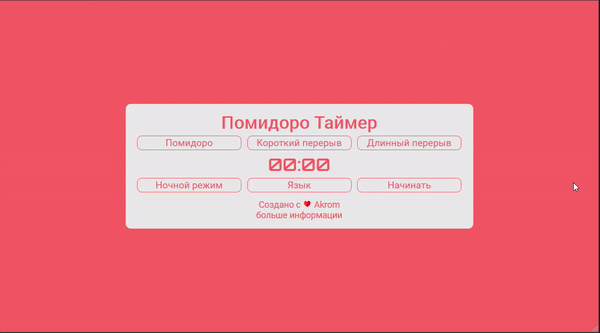

# Pomodoro Timer

To see this site demo
[click here](https://filp-color.netlify.app/)

*****************************************************************
Used technologies: 

  
  
  
  

In this project used:
Pure 
HTML/CSS/SASS and
Vanilla JavaScript
None of frameworks used in this project
like React or Vue

<!-- For logo

 -->
